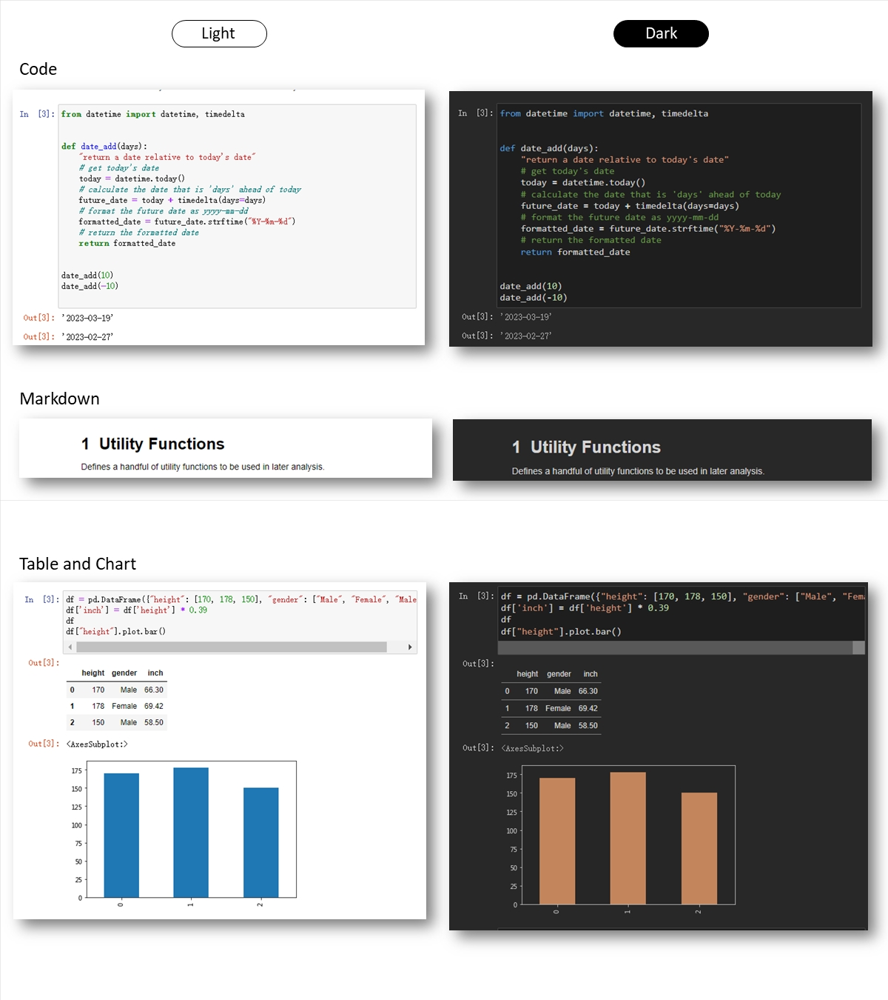

Dark Mode
=========

Adds a Dark Mode apperance for Jupyter Notebook.

## Preview


## Installation

Download this repo
```
$git clone https://github.com/alanhyue/jupyter-darkmode
```

Install and enable the extension

```
$jupyter nbextension install jupyter-darkmode
$jupyter nbextension enable jupyter-darkmode/main
```

## Usage

Once enabled, you can find the Dark Mode menu under *Toolbar > View > Dark Mode*. There are three ways to control the appearance of your notebook:

1. **Follow System**. Meaning the plugin will synchronize the dark mode setting of your browser and operating system. If your system is configured to turn on dark mode on sunset, so will your notebook. This is the best way to keep your notebook's appearance aligned with other applications you are working with. This is the recommended and default setting.
2. **Light**. Force to always use the light theme.
2. **Dark**. Force to always use the dark theme.

## Thank you

Thank you for using Dark Mode. If you have issues or suggestions, please raise a ticket. If you like this extension, consider starring this repo! 